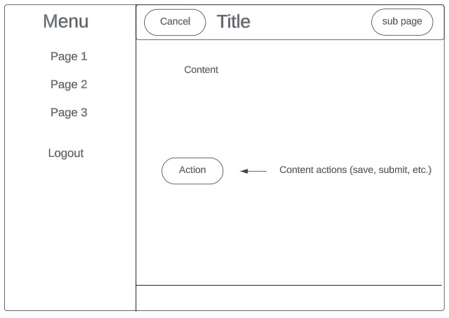
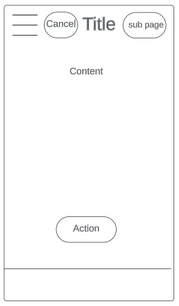
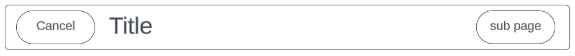

# Front End Style Guide
## Overview
The Tribe App will eventually be deployed as a mobile app. Therefore, it is encouraged to use best practices for mobile design and hybrid mobile/web design.

## Pages and Subpages
Pages represent the main features of the app, such as attributes and profile. Subpages include page-specific actions, such as create and edit.

### Page and Subpage Layout
The page and subpage layout includes the following:
- header (see [Shared Header](#shared-header))
- page content
- footer

Webpage Layout



Mobile Layout



## Shared Components

### Shared Header
Shared headers are included on all pages and subpages and include the following items:
- Page title - **required**
- Primary action button (a link to subpages, such as edit) - *optional*
- Secondary action button (a cancel or back button to go back to parent page) - *optional*

Header Layout



### Adding Shared Header to a Page

1. Add the shared components module to the page module

*Example:*
```
import { SharedComponentsModule } from '../../_shared-components/shared-components/shared-components.module';

@NgModule({
  imports: [
    CommonModule,
    FormsModule,
    IonicModule,
    AttributesPageRoutingModule, 
    SharedComponentsModule
  ],
```

2. Add the relevant header properties to the page.ts file 
   - page title
   - primary action button text (if any)
   - secondary action button text (if any)

*Example from Attributes page:*
```
headerPageTitle: string = 'Attributes';
headerPagePrimaryActionButtonText: string = 'Create';
```

3. Add a getButton method to the page.ts file
   - The header properties for the primary and secondary action button functions expect a value of: () => void. If this does not exist, or if there is a button method that returns a different value, create a new method (or refactor the current one) to return the appropriate value.
   - note: the below example captures the current instance of "this" by storing it in the property "self" and passes it along to the header. Without this step, the header cannot access the correct instance.

*Example from Attributes page*
```
// old method
  onCreateBtnClick() {
      this.navigateTo('attributes/create');
  }

  //new method
  getCreateBtnClickFunc() {
    const self = this;
    return () => {
      self.navigateTo('attributes/create');
    }
  }

  navigateTo(url?: string) {
    url = url || 'nav';
    this.router.navigate([url], { replaceUrl: true });
  }
```

4. Add the shared header tags to the page.html file and include all relevant properties from the header

*Example from Attributes page:*
```
<app-header [currentPageTitle]="headerPageTitle" [displayPrimaryActionButton]="true"
  [primaryActionButtonText]="headerPagePrimaryActionButtonText"
   [primaryActionButtonFunc]="getCreateBtnClickFunc()"></app-header>
```

## Site Navigation
Navigation structure is as follows:
- main menu
  - Pages
  - Logout button
- page header
  - Primary action button: go to subpage
  - Secondary action button: go back to parent page
- page footer
  - tbd

## Style Guide Editing Information
Last updated: July 2023 mrsbluerose
Mockup diagrams created with lucidchart.com.
